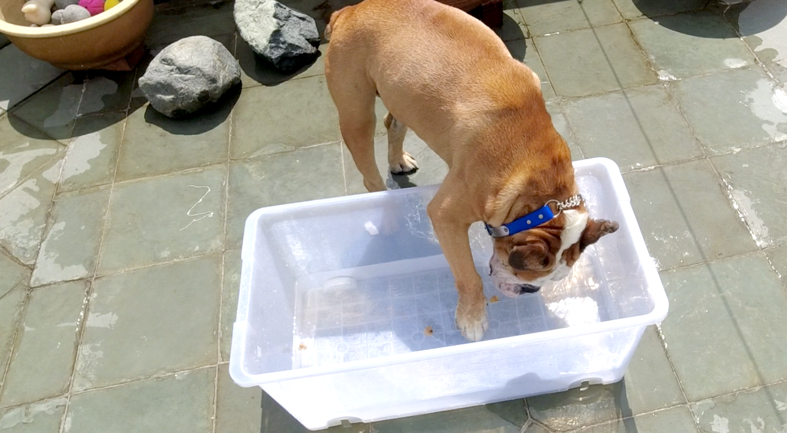

DOGGY ENRICHMENT IDEAS

8 DIY doggy enrichment ideas specifically for boisterous big dogs. 

1. THINK INSIDE THE BOX!

Thinking Inside the Box( literally) 
The simplest things around the house could be the most fun for your dogs! Take a couple of cardboard boxes (different sizes). Now arrange them according to size! Have the smallest box inside the bigger boxes and  scatter treats in it. Now let your dog have at it! This gets them to use their nose to look for the treats and it wore George(English bulldog) out really fast. 

2. NOSEWORK: CLOTH VERSION 

Take a cloth, preferably a thicker one so it doesn’t move too much when your dog paws at it. Put some treats on it and fold your cloth into half( always start easy to encourage your dog to use their brains to figure out where the treats are). I initially thought it’d be so easy for them, but once I folded the cloth. It was as if I was a magician( they thought the treat disappeared). Always encourage! And when they get better, you can increase the challenge by rolling the cloth or folding the cloths more! 

3. NOSEWORK: TUBS AND CLOTH VERSION 

4. FROZEN IN TIME 

5. GONE FISHING 

6. SELF ENTERTAINMENT 

7. SPIN THE BOTTLES 

8. FIND THE SNEAKY TURTLE 

<iframe width="560" height="315" src="https://www.youtube.com/embed/QpxjU5_GPa4" title="YouTube video player" frameborder="0" allow="accelerometer; autoplay; clipboard-write; encrypted-media; gyroscope; picture-in-picture" allowfullscreen></iframe>

