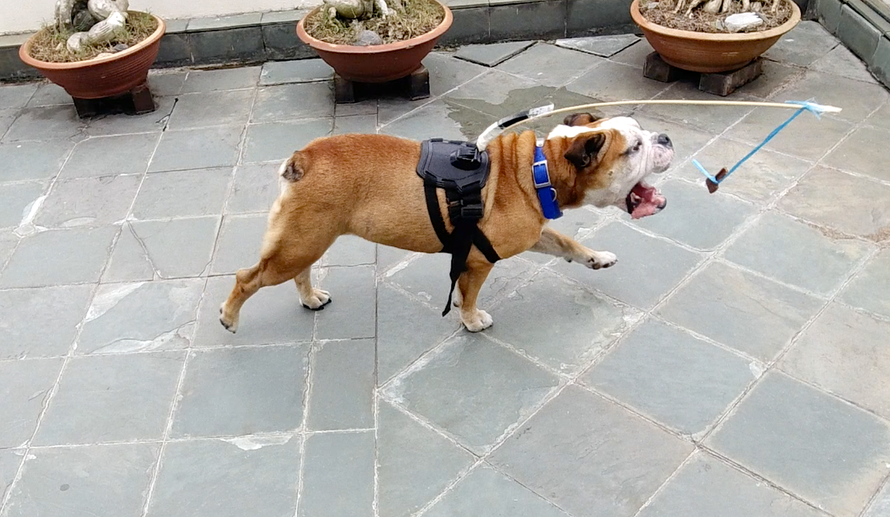

DOGGY ENRICHMENT IDEAS

8 DIY doggy enrichment ideas specifically for boisterous big dogs. 

1. THINK INSIDE THE BOX!

Thinking Inside the Box(literally) 
The simplest things around the house could be the most fun for your dogs! Take a couple of cardboard boxes (different sizes). Now arrange them according to size! Have the smallest box inside the bigger boxes and  scatter treats in it.

Now let your dog have at it! 

This gets them to use their nose to look for the treats and it wore George(English bulldog) out really fast. 

2. NOSEWORK: CLOTH VERSION 

Take a cloth, preferably a thicker one so it doesn’t move too much when your dog paws at it. Put some treats on it and fold your cloth into half( always start easy to encourage your dog to use their brains to figure out where the treats are).

I initially thought it’d be so easy for them, but once I folded the cloth. It was as if I was a magician( they thought the treat disappeared). Always encourage!

 And when they get better, you can increase the challenge by rolling the cloth or folding the cloths more! 
<iframe width="560" height="315" src="https://www.youtube.com/embed/x40uhNhIqm8" title="YouTube video player" frameborder="0" allow="accelerometer; autoplay; clipboard-write; encrypted-media; gyroscope; picture-in-picture" allowfullscreen></iframe>

3. NOSEWORK: CONTAINER PARTY VERSION!

It’s Nosework with a twist! This time I used buckets and containers around the house to set up a nose work course! Put treats under the containers and cloths- If you have buckets with tiny holes in them even better! Dogs have such an incredible sense of smell. If they’re treat motivated, this game would be such a thrill for them! I seated and watching while I set up the course (to give them hints!) I like to encourage independence in dogs, so I’d only nudge them in the right direction if they seem discouraged(George couldn’t find the treats in the cloth) so I adjusted the cloth a little to adjust his blur sails to the right direction!

4. FROZEN IN TIME 

I’m always looking for ways to give a dog a job he enjoys. George in particular has a total love for food and he’d do anything for it. He always gobbles his food down in a split second and looks to me like ’ok mom, what next?’ So I froze his treats. Take a bowl, place your dog’s favourite treats in it and freeze it! It’s such a fun treat for your dog especially on a hot day!

5. GONE FISHING 

It’s so important to get your dogs to use their brains. It reduces boredom and destructiveness around the house. You don’t have to always get store bought puzzles. Sometimes the simplest things are what they enjoy most. It’s so fun watching them think. They might paw at the water, dip their heads in, or just tip the bucket over. George did all of the above!

 Fill a tub / bucket with water. I love having the dogs watch the setup process so it gives them hints on what the game might be like.

 Next, have them go fishing- with their favourite treats of course! Show your dogs the treats, and put some in the bucket.

It’s so fun watching them think. They might paw at the water, dip their heads in, or just tip the bucket over. George did all of the above!

6. LOOP THE LOOP

This is self entertainment in all it’s splendour. What do you do when you have a dog full of energy and you can’t keep pace? (Not get another dog) Have him match his own speed with the loop the loop game! 
<iframe width="560" height="315" src="https://www.youtube.com/embed/AyxoxnLSJTI" title="YouTube video player" frameborder="0" allow="accelerometer; autoplay; clipboard-write; encrypted-media; gyroscope; picture-in-picture" allowfullscreen></iframe>

It’s really up to your imagination on how to attach a rod to your dog’s harness. I used masking tape to attach a rod to George’s harness. 

Next, tie a string at the end of the rod and attach a treat to the string. And off he goes, let him chase the treat! I intervened once in awhile to give him the treat because (A+ for effort)

7. SPIN THE BOTTLES 

When store bought dog puzzles are too small for your dog’s big paws, we make diy bottle games! 

Drill two holes halfway each side of the plastic bottle.

Put the stick through the holes. Next, place some treats in the bottle and hold on to both ends of the stick. You can adjust the degree of difficulty by changing the position of the holes in the bottle. The further up the bottle holes are placed, the harder it is to make the bottle topple. 

George is really food motivated so the holes were placed pretty high up the bottles. 
<iframe width="560" height="315" src="https://www.youtube.com/embed/8T2N3xffEPo" title="YouTube video player" frameborder="0" allow="accelerometer; autoplay; clipboard-write; encrypted-media; gyroscope; picture-in-picture" allowfullscreen></iframe>

8. FIND THE SNEAKY TURTLE 

Dogs have the natural instinct to hunt. And if you don’t have a field of rabbits for your dog to chase, we cut holes in a cardboard box as proxy.

First, cut a cardboard with a few holes in it.

You can either lean it on a wall, or hide in the box and pop a toy/treat out the holes to start the hunting game! 
<iframe width="560" height="315" src="https://www.youtube.com/embed/QpxjU5_GPa4" title="YouTube video player" frameborder="0" allow="accelerometer; autoplay; clipboard-write; encrypted-media; gyroscope; picture-in-picture" allowfullscreen></iframe>

